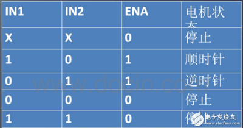

# LiDAR ROS Wireless Charging Robot


---


This is source code for the lower machine(STM32) in a ROS robot project.


# keywords

* movement control
* gyroscope driver
* DSP driver
* Attitude Determination
* odometer
* LiDAR
* Indoor Positioning
* Indoor Mapping
* Indoor
* Navigation
* Wireless Charging
* Wireless Charging
* Internet of Things;
* Obstacle Avoidance
* Robot Operating System
* Wireless Communication


## Prerequisites
(Only tested on) macOS Mojave 10.14.2 and Windows 10 with:
* Python 2.7
* Tensorflow-gpu >= 1.1
* opencv2
* setproctitle
* matplotlib
* qt(for mac)

## The Project Report

**摘要**

物联网依靠无线传感器进行信息传输。无线传感器需要电池供电。如果无线传感器嵌入到物体内部，导致电池更换代价高或者不方便。如果用无线充电来给嵌入式的无线传感器进行能量供应，会为物联网应用带来极大的便利。然而，在大型仓储系统等应用场景中，往往会有较多的无线传感器分布在一个大尺度空间的不同区域或者不同位置甚至是不同的平面，如果只是采用集中式的固定的无线充电系统，人工操作成本和资源成本过大，并且在布局上显得过于拥挤。

以及随着近些年人工智能领域的飞速发展，云-边-端结构的逐渐稳定，也带动着物联网产业、机器人领域的发展。本次项目旨在设计出一款可以自动导航到目的地并为目标进行无限充电的机器人（或小车）

**关键词**: 激光雷达；室内定位；室内建图；室内导航；无线充电；物联网；避障；ROS；无线通信

**Abstract**

The Internet of Things relies on wireless sensors for information
transmission and wireless sensors require battery power. If the wireless
sensor is embedded inside the object, the battery replacement is costly
or inconvenient. But if wireless charging is used to supply energy to
embedded wireless sensors, it will bring great convenience to IoT
applications. However, in application scenarios such as the large-scale
storage systems, there are often more wireless sensors distributed in
different areas or different locations even different planes in a
large-scale space. If only a centralized fixed wireless charging system
is used, manual operation costs and resource costs. Too big and too
crowded on the layout.

And with the rapid development of artificial intelligence in recent
years, the cloud-edge-end structure is gradually stable, which also
drives the Internet of Things industry. The development of the robot
field aims to design an automatic navigation to the destination and
Robot (or trolley) with unlimited target charging

**Key words:** LiDAR; Indoor Positioning; Indoor Mapping; Indoor
Navigation; Wireless Charging; Wireless Charging; Internet of Things;
Obstacle Avoidance; Robot Operating System; Wireless Communication

概述
====

本次课设我们设计编程并组装的智能充电机器人能够达到wifi与物联网设备通信，自动室内定位并建图；智能导航避障并给物联网设备充电的功能。具体来讲，本设备采用树莓派作为上位机运行ROS系统，利用激光雷达进行室内定位、建图、智能规划路径、避障，通过串口中断给下位机STM32发送指令，并通过STM32控制电机。STM32部分，通过L298N与编码器，利用PID算法控制电机。同时，通过I2C，移植驱动控制MPU6050芯片，并且通过软解姿态得到IMU数据（四元数、欧拉角），并反馈到上位机作为建图数据。最终成果完成了所有要求的功能，具有极好的避障与室内建图、路径规划、定位效果。本报告主要围绕我参与的部分：STM32下位机软件的开发与机器人底盘的组装

项目背景
========

物联网（IoT，Internetofthings）即“万物相连的互联网”，是互联网基础上的延伸和扩展的网络，将各种信息传感设备与互联网结合起来而形成的一个巨大网络,物联网依靠无线传感器进行信息传输。无线传感器需要电池供电。如果无线传感器嵌入到物体内部，导致电池更换代价高或者不方便。如果用无线充电来给嵌入式的无线传感器进行能量供应，会为物联网应用带来极大的便利。然而，在大型仓储系统等应用场景中，往往会有较多的无线传感器分布在一个大尺度空间的不同区域或者不同位置，如果只是采用集中式的固定的无线充电系统，人工操作成本和资源成本过大，并且在布局上显得过于拥挤。因此，如果考虑利用移动小车作为电源移动供应站，向嵌入到固定固体内部的传感器节点进行无线充电，可较好地解决这个问题。一方面这个任务的复杂度并不高，只是对于充电这个过程需要重复，可大大节约人力成本，另一方面，在小车电量充足情况下，可以进行全天候的电量监控，灵活性较高；并且在大规模的仓储系统中，往往可以借用多个小车在同一个局域网下通信完成对所有传感器的电量监测和充电。

项目目标
========

STM32下位机的开发目标有以下几点：

1.  小车差速二轮运动学计算

2.  MPU6050实现底盘IMU模块

3.  PID算法与PWM控速

4.  串口通讯与同步

可行性分析
==========

硬件方案可行性分析
------------------

**机器人实现方案**：采用STM32作为主控，树莓派作为上位机的方案是常用的ROS机器人实现方案。其中激光雷达的精度完全适用于本项目的情景。树莓派传输发送指令控制STM32进而控制底盘运动，并在底盘实现伺服电机测速和陀螺仪测速将速度信息发送给上位机ROS进行控制。

**物联网设备电量监测方案：**

1.电量监测方案——通过库伦计数器来监测电量；LTC-4510模块可以对单位时间内通过模块的电量进行监测，然后算出一段时间的积分值，当这个积分值小于规定的阈值时，通知需要充电；

2.电量监测方案——通过电路分压监测；利用电量过低时，输出电压会变低，通过监测相应的分压电阻上的电压来进行电量监测，当分压电阻电压小于某一个阈值时，通知需要充电；

3.无线通信方案——WiFi；

4.无线通信方案——BlueTooth；

**方案可行性分析：**

1.  **电量监测方案分析**：库伦计数方案利用电流计数，精度较高，可靠性较强，但是在实现过程中，由于模块限制，需要稳压器稳定模块电压在3.3v\~3.7v之间；此外，同时需要一个锂电池电源连接在模块上，完成库伦计数过程，以及一个稳压源，提供模块的工作电压；电压监测直接利用分压电阻的电压，但是未知锂电池电量将要耗尽时，其输出电压（曲线），无法判断需要充电时的阈值，只能做一个大概估计；但是在电路实现上较为简单，只需要用一个ADC模拟电平引脚将模拟电压（0\~3.3v）映射到[0~1023]的区间内，通过内在逻辑即可判断是否缺电。综合考虑中，由于从发出充电请求信号到小车前往相应传感器充电这一过程中，可能会有其他的传感器在待充电列表中，并且小车的路径规划算法以”最短路径优先“为原则，可能造成传感器等待充电时间略长，而在等待的这段时间内，传感器也在不断的耗电，所以在设计过程中不妨将”待充电“阈值设置稍微偏高，为这一段的等待时间留有余电。在这种情景下，对于电量监测的精度我们并没有特别或者急切的需求，相反，为了追求电路的简洁和功能的有效性，电压监测更适合这个场景；最终决定选择电压监测方案。

2.  **无线通信方案分析**:蓝牙方案连接稳定迅速，但是功耗较大，以及普通的蓝牙模块有效稳定传输距离在30m内，无法适应大尺度的空间（如项目背景中提到的仓储系统）；WiFi方案的优点主要有以下几个：传输距离远，点到点传输距离可达100m，并且能保持信号的稳定；功耗低，由于可以按需连接，并不会损耗太多电量；可扩展性好，尽管在测试（实验室空间）中并不能体现这一点，但是在大型的仓储系统中，通过联网和路由转发的方式，可以保证信息在大尺度空间中的传达，并且容易同云端接入，便于监控和调整。最终选择WiFi作为无线通信的最终方案，在局域网中建立“星型拓扑”，一个Server（小车）和多个Client（传感器模块）的socket通信。

硬件电路选取与设计
------------------

### 下位机

下位机我们选用了STM32H743ZI开发板，STM32系列专为要求高性能、低成本、低功耗的嵌入式应用设计的ARMCortex®-M0，M0+，M3,M4和M7内核。STM32是“意法半导体”生产的基于“ARM公司Cortex-M3内核”的32位高性能MCU。它有足够的I2C与GIPO接口来完成驱动电机等下位机工作，且有足够的算力以10Hz进行姿态解算等软件工作。


### 电机驱动


电机驱动我们采用L298N作为电机驱动板，L298N是一种双H桥电机驱动芯片，其中每个H桥可以提供2A的电流，功率部分的供电电压范围是2.5-48v，逻辑部分5v供电，接受5vTTL电平。

### IMU模块

我们选用MPU6050六轴陀螺仪模块作为IMU模块，MPU-6050为全球首例整合性6轴运动处理组件，相较于多组件方案，免除了组合陀螺仪与加速器时间轴之差的问题，减少了大量的封装空间。

MPU-6050的角速度全格感测范围为±250、±500、±1000与±2000°/sec(dps)，可准确追踪快速与慢速动作，并且，用户可程式控制的加速器全格感测范围为±2g、±4g±8g与±16g。产品传输可透过最高至400kHz的IIC或最高达20MHz的SPI（MPU-6050没有SPI）。MPU-6000可在不同电压下工作，VDD供电电压介为2.5V±5%、3.0V±5%或3.3V±5%，逻辑接口VDDIO供电为1.8V±5%（MPU6000仅用VDD）。MPU-6000的包装尺寸4x4x0.9mm(QFN)，在业界是革命性的尺寸。其他的特征包含内建的温度感测器、包含在运作环境中仅有±1%变动的振荡器。


### 室内定位模块

经过对本次实验任务精度要求和避障要求等的分析，我们决定采用激光雷达进行室内定位。我们采用了SLAMTEC的RPLIDARA1激光雷达。其具有12m半径的测量范围，360°扫描，8000Hz测量采样率，0.2cm的分辨率。能够满足本次任务的测量精度。


### 上位机

我们选用树莓派作为上位机，运行Ubuntu与ROS操作系统。树莓派由注册于英国的慈善组织“RaspberryPi基金会”开发，Eben·Upton/埃·厄普顿为项目带头人。2012年3月，英国剑桥大学埃本·阿普顿（EbenEpton）正式发售世界上最小的台式机，又称卡片式电脑，外形只有信用卡大小，却具有电脑的所有基本功能。它是一款基于ARM的微型电脑主板，以SD/MicroSD卡为内存硬盘，卡片主板周围有1/2/4个USB接口和一个10/100以太网接口（A型没有网口），可连接键盘、鼠标和网线，同时拥有视频模拟信号的电视输出接口和HDMI高清视频输出接口，以上部件全部整合在一张仅比信用卡稍大的主板上。


### 电机

我们选用了带编码器的直流减速电机作为机器人的电机。编码器是一种将旋转位移转换成一串数字脉冲信号的旋转式传感器，这些脉冲能用来控制角位移，如果编码器与齿轮条或螺旋丝杠结合在一起，也可用于测量直线位移。编码器AB相控制直流电机转速可以用示波器看旋转编码器反馈速度信号的频率来计算速度。也可以通过STM32的TIM接口进行程序读取。

{width="3.1770833333333335in"
height="2.1979166666666665in"}

### WIFI模块

ESP8266EX 集成了 32 位 Tensilica 处理器，CPU 时钟速度最高可达 160
MHz，支持实时操作系统 (RTOS) 和 Wi-Fi 协议栈，可将高达 80%
的处理能力留给应用编程和开发。、标准数字外设接口、天线开关、射频
balun、功率放大器、低噪放大器、过滤器和电源管理模块等，仅需很少的外围电路，可将所占
PCB
空间降低。其专为移动设备、可穿戴电子产品和物联网应用而设计，通过多项专有技术实现了超低功耗。ESP8266EX
具有的省电模式适用于各种低功耗应用场景。


软件方案可行性分析
------------------

### STM32下位机编程

根据ROS系统的要求，下位机需要实现的功能有：

1.  小车运动学编程

> 通过上位机的速度输入计算得到双轮转速，可以通过运动学算法实现。

1.  小车里程计

> 将精确的里程数据递交给上位机用于建图，可以通过马达编码器实现。

1.  PWM车轮驱动与控速

> 要实现精准控速，可以通过TIM接口输出PWM波，并且结合码盘数据，利用PID算法实现精准控速。

1.  姿态解算

> 要计算出小车的三轴欧拉角：俯仰、翻滚、偏航数据递交给上位机用于建图，可以通过陀螺仪数据硬解或者软解实现。

1.  接受/发送数据

> 要和上位机通讯，可以通过串口通讯实现。

我们最终选定的软件控制关系如图所示


其中MPU6050的驱动移植和姿态解算难度较大，整体编程可以完成。

### 树莓派上位机编程

路径规划是本次项目最主要的问题，涉及到定位、导航和最短路径问题。通过前期调研，我们确定了以下几种定位导航方法：1.WiFi定位导航，2.GPS定位导航，3.激光雷达定位导航。经过仔细分析这三种方法：我们发现前两种不易实现。WiFi定位导航的技术要求太高，以我们目前的水平很难实现。其次，WiFi定位的精度太低，不太使用于室内。GPS定位导航也被定位精度限制。最终，我们选择利用激光雷达基于ROS平台来实现定位导航。


上位机需要实现的功能有：

**环境搭建**

本次项目基于Ubuntu16.04系统与ROS平台。在树莓派上安装并配置ubuntu和ROS很容易实现

**室内定位**

室内定位我们选用Gmapping包。Gmapping包是在ROS里对开源社区openslam下gmapping算法的C++实现，该算法采用一种高效的Rao-Blackwellized粒子滤波将收取到的激光测距数据最终转换为栅格地图。

机器人定位与建图通常被认为是“鸡与鸡蛋”的问题，因为这个原因才会将这个过程命名为SLAM（Simultaneouslocalizationandmapping），所以即时定位与地图构建（SLAM）是这样一个概念：把两方面的进程都捆绑在一个循环之中，以此支持双方在各自进程中都求得连续解；不同进程中相互迭代的反馈对双方的连续解有改进作用。

占据栅格地图的构建主要采取粒子滤波的方法，粒子滤波是目前一种可以代替高斯滤波器的广为流行的滤波器是非参数化滤波器。非参数化滤波器不需要满足扩展卡尔曼滤波算法所要求的非线性滤波随机量必须满足高斯分布的条件，它也不依赖于一个固定的后验方程去估计后验状态，而是从后验概率中抽取随机状态粒子来表达其分布。粒子滤波就是一种非参数化滤波器的实现算法，粒子滤波的关键是从后验分布中产生一组随机状态样本来表示后验概率分布。

1.  **室内导航**

Navigation栈是一个获取里程计信息、传感器数据和目标位姿并输出安全的速度命令到运动平台的2D导航包的集合，我们可以通过它来实现室内导航，其要点有以下两点。

* (1)定位

机器人在导航的过程中需要时刻确定自身当前的位置，Navigation栈中使用amcl包来定位。amcl是一种概率定位系统，以2D方式对移动机器人定位，它实现了自适应（或者KLD-采样）蒙特卡洛定位法，使用粒子滤波跟踪机器人在已知地图中的位姿。下面的图片显示用里程计和AMCL定位的不同之处，AMCL估计base结构（机器人）相当于global结构(世界地图)TF转换（ROS中的坐标系转换）。从本质上，这种转换利用航位推算来处理漂移，所发布的转换是远期的。

* (2)路径规划

路径导航部分则使用move\_base包，move\_base能够获取机器人周围信息（如激光雷达扫描结果）并生成全局与局部的代价地图，根据这些代价地图可以使机器人绕开障碍物安全到达指定的位置。move\_base的路径规划主要分为全局规划和局部规划，分别采用的是A\*算法和DWA（DynamicWindowApproach)）算法。

技术要点
========

系统框图
--------

本次项目是基于STM32H743ZI下位机控制机器人底盘，与上位机树莓派ROS通过串口中断进行数据互通，具体系统组成如图所示。

我负责的主要是下位机的软件部分。故本报告仅涉及STM32的技术要点。

编程实现
--------

### 电机驱动

电机驱动模块采用L298n，L298N是专用驱动集成电路，属于H桥集成电路，与L293D的差别是其输出电流增大，功率增强。其输出电流为2A，最高电流4A，最高工作电压50V，可以驱动感性负载，如大功率直流电机，步进电机，电磁阀等，特别是其输入端可以与单片机直接相联，从而很方便地受单片机控制。当驱动直流电机时，可以直接控制步进电机，并可以实现电机正转与反转，实现此功能只需改变输入端的逻辑电平。

**L298N逻辑功能表**



所以，通过TIM输出PWM波便可以控制电机转速，而通过gpio可以直接控制电机的正反转，将这些功能封装便得到了电机控制函数。

```c
void motor_driver::spin(int16_tpwm){
if((rpm_cur>0&&pwm<0)||(rpm_cur<0&&pwm>0)){
__HAL_TIM_SET_COMPARE(&_pwm_htim,_pwm_channel,0);
}
if(pwm>0){
HAL_GPIO_WritePin(_gpiox_in,_pin_in2,GPIO_PIN_RESET);
HAL_GPIO_WritePin(_gpiox_in,_pin_in1,GPIO_PIN_SET);
}
if(pwm<0){
HAL_GPIO_WritePin(_gpiox_in,_pin_in1,GPIO_PIN_RESET);
HAL_GPIO_WritePin(_gpiox_in,_pin_in2,GPIO_PIN_SET);
pwm=-pwm;
}
__HAL_TIM_SET_COMPARE(&_pwm_htim,_pwm_channel,pwm);
}
```

### PID控制

在过程控制中，按偏差的比例（P）、积分（I）和微分（D）进行控制的PID控制器（亦称PID调节器）是应用最为广泛的一种自动控制器。小到控制一个元件的温度，大到控制无人机的飞行姿态和飞行速度等等，都可以使用PID控制。

代码中，首先利用C语言与C++联合编程，创建一个马达类driver\_motor，实现PID控制算法。

```c
void motor_driver::set_rpm(floatrpm){
int16_t_pwm;
doubleerr;

rpm_cur=read_rpm();

err=constrain(rpm,-_motor_max_rpm,_motor_max_rpm)-rpm_cur;
err_total+=err;

err_total=constrain(err_total,-_pwm_max/_i,_pwm_max/_i);
_pwm=_p*err+_i*err_total+_d*(err-err_previous);

err_previous=err;

_pwm=constrain(_pwm,-_pwm_max,_pwm_max);

if(abs(_pwm)<40){
_pwm=0;
}
spin(_pwm);
//print_usart1("%d\r\n",_pwm);
}
```

其中read\_rpm();是从电机编码器中计算出转速的函数。

```c
Double motor_driver::read_rpm(){
uint32_tcur_milli_time=0;
doubledelta_mins_time;
tick_cur=get_tick_inc();
cur_milli_time=Millisecond();

delta_mins_time=(cur_milli_time-last_milli_time)/60000.0;
rpm_cur=(tick_cur/_ticks_per_rev)/delta_mins_time;
last_milli_time=cur_milli_time;
returnrpm_cur;
}
```

\_pwm=\_p\*err+\_i\*err\_total+\_d\*(err-err\_previous); 中\_p、\_i、\_d就是PID算法的三个参数。通过调整参数可以调整PID控制算法的响应速度等指标。PID控制中P、I、D参数分别起比例作用、积分作用与差分作用。


1.  **比例作用**

比例控制器实际上就是个放大倍数可调的放大器，即△P=Kp×e，式中Kp为比例增益，即Kp可大于1，也可小于1；e为控制器的输入，也就是测量值与给定值之差，又称为偏差。

要说明的是，对于大多数模拟控制器而言，都不采用比例增益Kp作为刻度，而是用比例度来刻度，即δ=1/Kc×100%。也就是说比例度与控制器的放大倍数的倒数成比例；控制器的比例度越小，它的放大倍数越大，偏差放大的能力越大，反之亦然。

比例控制有个缺点，就是会产生余差，要克服余差就必须引入积分作用。

1.  **积分作用**

控制器的积分作用就是为了消除自控系统的余差而设置的。所谓积分，就是随时间进行累积的意思，即当有偏差输入e存在时，积分控制器就要将偏差随时间不断累积起来，也就是积分累积的快慢与偏差e的大小和积分速度成正比。只要有偏差e存在，积分控制器的输出就要改变，也就是说积分总是起作用的，只有偏差不存在时，积分才会停止。

对于恒定的偏差，调整积分作用的实质就是改变控制器输出的变化速率，这个速率是通过积分作用的输出等于比例作用的输出所需的一段时问来衡量的。积分时间小，表示积分速度大，积分作用就强；反之，积分时问大，则积分作用就弱。如果积分时间无穷大，表示没有积分作用，控制器就成为纯比例控制器。

积分作用很少单独使用，通常与比例作用一起使用，使其既具有把偏差放大(或缩小)的比例作用，又具有将偏差随时间累积的积分作用，且其作用方向是一致的。这时控制器的输出为：△P=Ke+△Pi，式中△P为控制器输出值的变化；Ke为比例作用引起的输出；△Pi为积分作用引起的输出。

1.  **微分作用**

微分作用主要是用来克服被控对象的滞后。在常规PID控制器中，微分作用的输出变化与微分时间和偏差变化的速度成比例，而与偏差的大小无关，偏差变化的速度越大，微分时间越长，则微分作用的输出变化越大。但如果微分作用过强，则可能由于变化太快而由其自身引起振荡，使控制器输出中产生明显的“尖峰”或“突跳”。为了避免这一扰动，在PID调节器和DCS中可使用微分先行PID运算规律，即只对测量值PV进行微分，当人工改变控制器的给定值SP时，不会造成控制器输出的突变，避免了改变SP的瞬间给控制系统带来的扰动。如TDC-3000，则在常规PID算法中增加一个软开关，组态时供用户选择控制器对偏差、还是测量值进行微分。

通过测试，我们最后选择的参数是


```c
float motor\_driver::\_p=0.2;

float motor\_driver::\_i=0.5;

float motor\_driver::\_d=0.3;
```

之后，通过robot\_base类初始化两个马达类即可实现分别控制两轮。

```c
robot_base::robot_base()
{
motor_RL=newmotor_driver(htim3,1,htim1,TIM_CHANNEL_2,1500,U1_1_GPIO_Port,U1_1_Pin,U1_2_Pin);
motor_RR=newmotor_driver(htim4,-1,htim1,TIM_CHANNEL_1,1500,U2_1_GPIO_Port,U2_1_Pin,U2_2_Pin);
robot_linear_vel_x=0;
}
```


通过采用PID算法，我们消除了不同电机的误差，实现了精准控速。这对上位机ROS建图来说至关重要。

### 小车二轮差速运动学

编写STM32下位机程序的时候，需要用到航迹推演，无论是定位导航还是普通的方向控制。航迹推演中除了对机器人位姿进行估计，另一个很重要的关系是移动机器人前进速度、转向角速度与左轮速度、右轮速度之间的转换。这便是我们着重实现的小车运动学代码。

下图是移动机器人在两个相邻时刻的位姿，其中$\theta_{1}$是两相邻时刻移动机器人绕圆弧运动的角度，$theta_{3}$是两相邻时刻移动机器航向角（朝向角head）的变化量。*l*是左右轮之间的间距，*d*是右轮比左轮多走的距离。*r*是移动机器人圆弧运动的半径。


首先，移动机器人前进速度等于左右轮速度的平均。即


再来推导机器人航向角如何计算，以及如何计算角速度$\omega$。如图所示，把两个时刻的机器人位置叠加在一起，可以清楚的看到移动机器人航向角变化量是$\theta_{3}$。从图中的几何关系可以得到

$$\theta_{3} = \theta_{2} = \theta_{1}$$

也就是说移动机器人航向角变化了多少角度，它就绕其运动轨迹的圆心旋转了多少角度。而对于$\theta_{2}$，有下面的近似公式：


故角速度$\omega$有：


线速度、角速度都有了，因此可以推出移动机器人圆弧运动的半径：


所以有


因此，只要测量小车的轴距和车轮半径就能否完成小车的运动学解算。
```c

float robot_base::wheel_circumference=0.123;
float robot_base::wgeel_base_width=0.185;

void robot_base::velocity_to_RPM(floatliner_vel_x,floatangular_rad_z)
{
static float linear_vel_x_min;
static float angular_rad_z_min;
static float tangential_vel;
floatscale=1;
//print_usart1("%f\r\n",liner_vel_x);
linear_vel_x_min=liner_vel_x*60;
angular_rad_z_min=angular_rad_z*60;

tangential_vel=angular_rad_z_min*wgeel_base_width/2;

while(1)
{
motor_prm_RL=(linear_vel_x_min-tangential_vel)/wheel_circumference;
motor_prm_RR=(linear_vel_x_min+tangential_vel)/wheel_circumference;//ifzuoyourevertchange+-
if(abs(motor_prm_RL)<=motor_driver::_motor_max_rpm
&&abs(motor_prm_RR)<=motor_driver::_motor_max_rpm)
{
break;
}
scale-=0.0333334;
linear_vel_x_min*=scale;
tangential_vel*=scale;

}
run();

}

void robot_base::run()
{
//print_usart1("%f\r\n",motor_prm_RL);
motor_RL->set_rpm(motor_prm_RL*1.13);
motor_RR->set_rpm(motor_prm_RR);
doubleaverage_rpm=(motor_RL->rpm_cur+motor_RR->rpm_cur)/2;
doubleaverage_rps=average_rpm/60;

robot_linear_vel_x=average_rps*wheel_circumference;

}
```

通过在robot\_base类中实现运动学函数，初始化该类同时初始化两个马达类，调用他的内部函数，输入线速度和角速度两个参量就能够直接计算出小车两轮的转速，进而控制小车底座的运动。PID算法、PWM波和运动学算法结合起来让我们能够精确地控制小车的位置与速度。

### MPU6050陀螺仪的驱动

ROS建图需要的数据除了精确的里程计，还有一个很重要的就是Z轴的偏航数据。为了实现这点需要实现IMU惯性测量单元，我们选用了MPU6050。

MPU-6050是世界上第一款集成6轴MotionTracking设备。它集成了3轴MEMS陀螺仪，3轴MEMS加速度计，以及一个可扩展的数字运动处理器DMP（DigitalMotionProcessor），可用I2C接口连接一个第三方的数字传感器，比如磁力计。扩展之后就可以通过其I2C或SPI接口输出一个9轴的信号（SPI接口仅在MPU-6000可用）。MPU-60X0也可以通过其I2C接口连接非惯性的数字传感器，比如压力传感器。MPU-60X0对陀螺仪和加速度计分别用了三个16位的ADC，将其测量的模拟量转化为可输出的数字量。为了精确跟踪快速和慢速的运动，传感器的测量范围都是用户可控的，陀螺仪可测范围为±250，±500，±1000，±2000°/秒（dps），加速度计可测范围为±2，±4，±8，±16g。一个片上1024字节的FIFO，有助于降低系统功耗。和所有设备寄存器之间的通信采用400kHz的I2C接口或1MHz的SPI接口（SPI仅MPU-6000可用）。对于需要高速传输的应用，对寄存器的读取和中断可用20MHz的SPI。另外，片上还内嵌了一个温度传感器和在工作环境下仅有±1%变动的振荡器。芯片尺寸4×4×0.9mm，采用QFN封装（无引线方形封装），可承受最大10000g的冲击，并有可编程的低通滤波器。关于电源，MPU-60X0可支持VDD范围2.5V±5%，3.0V±5%，或3.3V±5%。另外MPU-6050还有一个VLOGIC引脚，用来为I2C输出提供逻辑电平。VLOGIC电压可取1.8±5%或者VDD。

为了使用MPU6050，我们首先需要一个I2C接口。实现I2C接口有两种方案，一种是通过GPIO重写I2C协议，实现模拟I2C。第二种是使用硬件I2C接口。在这次实验中我们两种均实现了，最后由于STM32板缺少CRH寄存器，故采用第二种。

GPIO模拟I2C重写的函数：
```C

#ifndef __USER_GPIO_I2C_H_
#define __USER_GPIO_I2C_H_
#include "stm32h7xx_hal.h"
#include "main.h"

void IIC_Init(void);

int IIC_Start(void);
void IIC_Stop(void);
void IIC_Send_Byte(uint8_t txd);
uint8_t IIC_Read_Byte(uint8_t ack);
int IIC_Wait_Ack(void);
void IIC_Ack(void);
void IIC_NAck(void);

int i2cWrite(uint8_t addr,uint8_t reg,uint8_t len,uint8_t *data);
int i2cRead(uint8_t addr,uint8_t reg,uint8_t len,uint8_t *buf);

uint8_t IICreadByte(uint8_t dev,uint8_t reg,uint8_t *data);
uint8_t IICWriteByte(uint8_t dev,uint8_t reg,uint8_t data);
uint8_t I2C_ReadOneByte(uint8_t I2C_Addr,uint8_t addr);
uint8_t IICWriteBit(uint8_t dev,uint8_t reg,uint8_t bitNum,uint8_t data);

uint8_t IICwriteBytes(uint8_t dev,uint8_t reg,uint8_t length,uint8_t *data);
uint8_t IICwriteBits(uint8_t dev,uint8_t reg,uint8_t bigStart,uint8_t length,uint8_t data);
uint8_t IICreadBytes(uint8_t dev,uint8_t reg,uint8_t length,uint8_t *data);


#endif
```


I2C开好后，只需要编译MPU6050的驱动，然后就可以通过以下函数读取加速度和角速度信息
```C
//9-GetAccelRawData
void MPU6050_Get_Accel_RawData(RawData_Def*rawDef);
//10-GetAccelscaleddata
void MPU6050_Get_Accel_Scale(ScaledData_Def*scaledDef);
//11-GetAccelcalibrateddata
void MPU6050_Get_Accel_Cali(ScaledData_Def*CaliDef);
//12-GetGyroRawData
void MPU6050_Get_Gyro_RawData(RawData_Def*rawDef);
//13-GetGyroscaleddata
void MPU6050_Get_Gyro_Scale(ScaledData_Def*scaledDef);
```

### 硬件姿态解算

得到了陀螺仪的数据并不够，上位机需要的数据是底座的姿态和偏航。所以需要通过rawdata进行姿态解算获得机体的姿态信息（欧拉角）


我们首先选用的是DMP硬解，MPU6050自带DMP硬解姿态芯片，使用该芯片的要点在于移植驱动，首先将我们自己编写的GPIO模拟I2C的函数移植到DMP驱动中替代硬件的I2C函数，就可以进行DMP操作了。
```c
//#include"i2c.h"
//#include"main.h"
//#include"board-st_discovery.h"

#define i2c_writei2cWrite
#define i2c_readi2cRead
#define delay_msHAL_Delay
#define get_ms(x)*x=HAL_GetTick()
```

使用DMP库重写的I2C读取出的是四元数，四元数（Quaternions）是由威廉·卢云·哈密尔顿(WilliamRowanHamilton,1805-1865）在1843年爱尔兰发现的数学概念。将实数域扩充到复数域，并用复数来表示平面向量，用复数的加、乘运算表示平面向量的合成、伸缩和旋，这就是我们熟知的复数的二维空间含义。利用三维复数不就可以表达三维空间的变换了吗，历史上有很多数学家试图寻找过三维的复数，但后来证明这样的三维复数是不存在的。有关这个结论的证明，我没有查到更明确的版本，据《古今数学思想》中的一个理由，三维空间中的伸缩旋转变换需要四个变量来决定：两个变量决定轴的方向，一个变量决定旋转角度，一个变量决定伸缩比例。样，只有三个变量的三维复数无法满足这样的要求。但是历史上得到的应该是比这个更强的结论，即使不考虑空间旋转，只从代数角度来说，三维的复数域作为普通复数域的扩张域是不存在的。并且，据《古今数学思想》叙述，即使像哈密尔顿后来引入四元数那样，牺牲乘法交换律，这样的三维复数也得不到。经过一些年的努力之后，Hamilton发现自己被迫应作两个让步，第一个是他的新数包含四个分量，而第二个是他必须牺牲乘法交换律。（《古今数学思想》第三册177页）但是四元数用作旋转的作用明显，简化了运算，而且避免了GimbalLock，四元数是最简单的超复数，我们不能把四元数简单的理解为3D空间的矢量，它是4维空间中的的矢量，也是非常不容易想像的。通过DMP自动输出的四元数，我们通过以下程序将其转换为三轴的欧拉角。

RPY1[0]=atan2(2\*(q2\*q3+q0\*q1),1-2\*(q1\*q1+q2\*q2));

RPY1[1]=asin(2\*(q0\*q2-q1\*q3));

RPY1[2]=atan2(2\*(q0\*q3+q1\*q2),1-2\*(q3\*q3+q2\*q2));

不过，由于STM32H7没有CRH寄存器，我们经过试验无法为I2C开放GPIO管，遂放弃DMP芯片，转用软解I2C算法。

### 软解姿态解算

利用陀螺仪得到的6轴信息，可以通过软解姿态得到欧拉角。为了控制陀螺仪漂移引起的误差，我们利用互补滤波，用陀螺仪数据补正加速度计数据，通过互补增加精度。再通过零偏抑制进一步减少误差。最后通过一阶龙哥库塔求解四元数微分方程得到归一化的四元数与欧拉角信息并交付给上层作为建图信息。设坐标系绕旋转α角后得到坐标系


则有矩阵形式的表达式如下：


旋转阵为


在三维空间中有


上面得到了一个表示旋转的方向余弦矩阵。欧拉角微分方程如下，其中左侧是本次更新后的欧拉角,对应row,pit,yaw。右侧，是上个周期测算出来的角度。三个角速度由直接安装在四轴飞行器的三轴陀螺仪在这个周期转动的角度，单位为弧度，计算间隔时T*陀螺角速度，比如0.02秒*0.01弧度/秒=0.0002弧度。间因此求解这个微分方程就能解算出当前的欧拉角。


但是，欧拉角微分方程中包含了大量的三角运算，这给实时解算带来了一定的困难，所以我们往往采用四元数法进行软解姿态。四元数法只求解四个未知量的线性微分方程组，计算量小，易于操作，是比较实用的工程方法。用欧拉角描述的方向余弦矩阵用四元数描述则为：


在软件解算中，我们首先把加速度计采集到的值(三维向量)转化为单位向量,即向量除以模，传入参数是陀螺仪x,y,z值和加速度计x,y,z值：
```c

float * READ_DMP2(void)
{
    MPU6050_Get_Gyro_Scale(&myGyroScaled2);
    //print_usart1("Gyro: x:%.3f, y:%.3f, z:%.3f\r\n", myGyroScaled.x, myGyroScaled.y, myGyroScaled.z);
    MPU6050_Get_Accel_Scale(&myAccelScaled2);
    //print_usart1("Accel: x:%.3f, y:%.3f, z:%.3f\r\n", myAccelScaled.x, myAccelScaled.y, myAccelScaled.z);
    long quat[4];
    float gx,gy,gz,ax,ay,az;
    float norm;

    gx = myGyroScaled2.x;
    gy = myGyroScaled2.y;
    gz = myGyroScaled2.z;
    ax = myAccelScaled2.x/1000.0f;
    ay = myAccelScaled2.y/1000.0f;
    az = myAccelScaled2.z/1000.0f;


    

    float vx, vy, vz;
    float ex, ey, ez;
    norm = sqrt(ax*ax + ay*ay + az*az);       
    ax = ax / norm; 
    ay = ay / norm; 
    az = az / norm;  
    //下面把四元数换算成方向余弦中的第三行的三个元素。刚好vx、vy、vz 。其实就是上一次的欧拉角（四元数）的机体坐标参考系换算出来的重力的单位向量。
    //estimated direction of gravity 
    vx = 2*(q1*q3 - q0*q2);
    vy = 2*(q0*q1 + q2*q3); 
    vz = q0*q0 - q1*q1 - q2*q2 + q3*q3; 
    //axyz是机体坐标参照系上，加速度计测出来的重力向量，也就是实际测出来的重力向量。
    //axyz是测量得到的重力向量，vxyz是陀螺积分后的姿态来推算出的重力向量，它们都是机体坐标参照系上的重力向量。
    //那它们之间的误差向量，就是陀螺积分后的姿态和加计测出来的姿态之间的误差。
    //向量间的误差，可以用向量叉积（也叫向量外积、叉乘）来表示，exyz就是两个重力向量的叉积。
   // 这个叉积向量仍旧是位于机体坐标系上的，而陀螺积分误差也是在机体坐标系，而且叉积的大小与陀螺积分误差成正比，正好拿来纠正陀螺。（你可以自己拿东西想象一下）由于陀螺是对机体直接积分，所以对陀螺的纠正量会直接体现在对机体坐标系的纠正。
    //integral error scaled integral gain 
    exInt = exInt + ex*Ki;
    eyInt = eyInt + ey*Ki; 
    ezInt = ezInt + ez*Ki; 
    //用叉积误差来做PI修正陀螺零偏
    //integral error scaled integral gain 
    exInt = exInt + ex*Ki; 
    eyInt = eyInt + ey*Ki; 
    ezInt = ezInt + ez*Ki;  // adjusted gyroscope measurements 
    gx = gx + Kp*ex + exInt; 
    gy = gy + Kp*ey + eyInt; 
    gz = gz + Kp*ez + ezInt; 
    //四元数微分方程，其中T为测量周期，为陀螺仪角速度，以下都是已知量，这里使用了一阶龙哥库塔求解四元数微分方程：
    //integrate quaternion rate and normalise 
    q0 = q0 + (-q1*gx - q2*gy - q3*gz)*halfT; 
    q1 = q1 + (q0*gx + q2*gz - q3*gy)*halfT; 
    q2 = q2 + (q0*gy - q1*gz + q3*gx)*halfT; 
    q3 = q3 + (q0*gz + q1*gy - q2*gx)*halfT;
    norm = 1.0f/sqrt(q0 * q0 + q1 * q1 + q2 * q2 + q3 * q3);
    q0 = q0 * norm;
    q1 = q1 * norm;
    q2 = q2 * norm;
    q3 = q3 * norm;
    q_new[0] = q0 / q30;
    q_new[1] = q1 / q30;
    q_new[2] = q2 / q30;
    q_new[3] = q3 / q30;
    RPY1[0] = atan2(2 * (q2 * q3 + q0 * q1), 1 - 2 * (q1 * q1 + q2 * q2));
    RPY1[1] = asin(2 * (q0 * q2 - q1 * q3));
    RPY1[2] = atan2(2 * (q0 * q3 + q1 * q2), 1 - 2 * (q3 * q3 + q2 * q2));
    return quat_rpy1;
}
```

### 串口通讯

在STM32我们编程实现了多个串口，STM32采用阻塞方式向上位机发送陀螺仪解算出的欧拉角与里程计结果，通过中断方式以10Hz频率接收上位机ROS的角速度与线速度，通过DMA方式输出DEBUG结果到电脑端超级终端。


### 主循环

上述的程序在主循环中以10Hz频率循环调用以达到动态操纵的效果。首先与上位机通讯，接受上位机速度信息，进行运动学计算与PID计算得到两轮PWM输入到轮。然后将软件解算的欧拉角传送给上位机进行建图。最后喂看门狗防止系统重启。

```c
while(1){
user_delay_ms_start(&loop_tick);
HAL_UART_Receive_IT(&huart6,(uint8_t*)&value,1);

xrobot->velocity_to_RPM(cmd_liner_vel_x,cmd_angular_rad_z);
//print_usart1("2\r\n");
HAL_IWDG_Refresh(&hiwdg1);
serial2_ros_data();
//print_usart1("7\r\n");
motor_driver::_p=set_p;
motor_driver::_i=set_i;
motor_driver::_d=set_d;
HAL_IWDG_Refresh(&hiwdg1);
user_delay_ms_end(&loop_tick,1000/rate);
}
```

**其中**user\_delay\_ms\_end(&loop\_tick,1000/rate);是通过\#define user\_delay\_ms\_end(t,Delay)*while*((HAL\_GetTick()-\*t)&lt;Delay){}定义的，他将每次循环的时间精确地控制在100ms.

### 小车组装


组装按照上图框图的结构进行组装，其中激光雷达在最上方，与树莓派相连，然后树莓派通过TTL转USB接口与STM32串口相连，MPU6050放在正中间。由于马达过长，我们不得不把一个马达挪到另一个孔位。

![J:\\Documents\\QQFiles\\1009181441\\Image\\Group\\Image6\\D\`3\[SHLY4G\_6B%E\]JBXD5\]Q.jpg](images/image30.png)


图中可见陀螺仪等连接逻辑


激光雷达建图和路径规划


